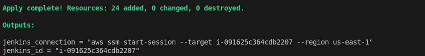
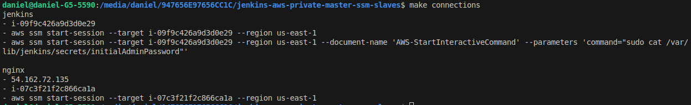
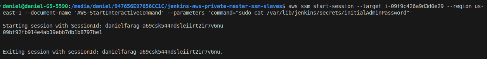
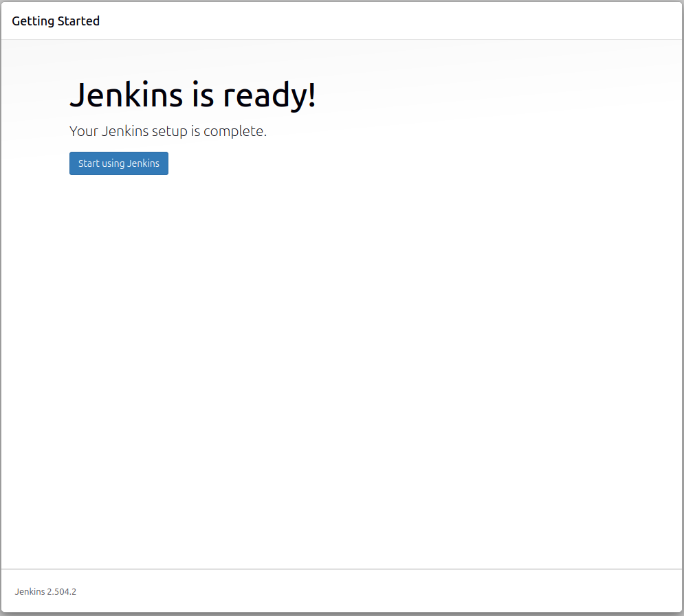
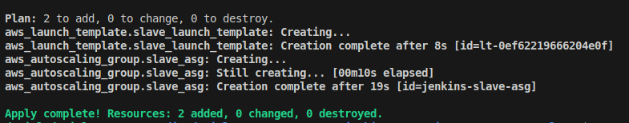
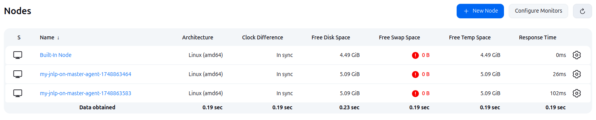
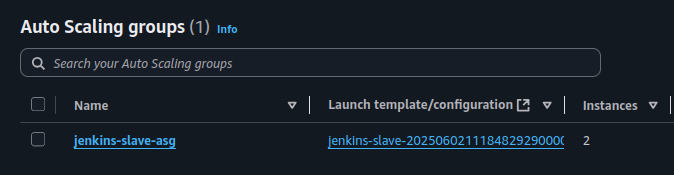
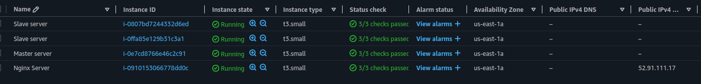

# Jenkins Master-Slave Architecture on AWS

This project deploys a Jenkins master-slave architecture on AWS using Terraform. It leverages AWS Systems Manager (SSM) for secure access to instances and automates the setup of Jenkins agents using auto-scaling groups, including automatic registration of new nodes and the capability to manage disconnected nodes.

## Project Overview

This Terraform project sets Jenkins master-slave setup:

  * **Network Module:** Deploys a VPC, public and private subnets, NAT Gateway, and security groups.
  * **Compute Module:** Deploys an Nginx web server in a public subnet and a Jenkins master server in a private subnet, both accessible via AWS SSM.
  * **Jenkins Slaves:** An Auto Scaling Group for Jenkins slave instances in a private subnet, configured to automatically register with the Jenkins master.

## Architecture

The architecture consists of:

  * **VPC:** A dedicated Virtual Private Cloud for network isolation.
  * **Public Subnets:** For external-facing resources like the Nginx web server.
  * **Private Subnets:** For internal resources like the Jenkins master, application servers, database servers, and Jenkins slaves, ensuring they are not directly accessible from the internet.
  * **NAT Gateway:** Allows instances in private subnets to initiate outbound connections to the internet (e.g., for updates, downloading dependencies).
  * **Security Groups:** Control inbound and outbound traffic to instances.
  * **Nginx:** A web server.
  * **Jenkins Master:** Running on an EC2 instance in a private subnet.
  * **Jenkins Slaves (Agents):** EC2 instances launched by an Auto Scaling Group in a private subnet, connecting to the Jenkins master via JNLP over WebSocket.
  * **AWS Systems Manager (SSM):** Used for secure shell access to the Jenkins master and Nginx server without opening SSH ports, and for running commands on the Jenkins slaves (implicitly by the user data script).
  * **S3 Backend for Terraform State:** Ensures collaborative and durable state management.

## Prerequisites

Before you begin, ensure you have the following installed and configured:

  * **AWS CLI:** Configured with credentials that have sufficient permissions to create AWS resources (EC2, VPC, S3, IAM, etc.).
  * **Terraform (v1.0.0+):** Installed on your local machine.
  * **`unzip`:** Needed for the `awscli` installation in the slave's user data script.
  * **`jq`:** Needed for parsing JSON in the slave's user data script.
  * **`make`:** (Optional but highly recommended) To simplify the execution of Terraform commands using the provided `Makefile`.

## Deployment Steps

This project uses a `Makefile` to streamline the deployment process.

### 1\. Initialize Terraform and Deploy Infrastructure

This step deploys the core networking components, the Nginx web server, and the Jenkins master server.

1.  **Navigate to the root directory of your project (where the `Makefile` is located).**

2.  **Run the `infra` target:**

    ```bash
    make infra
    ```

    This command will:

      * Initialize Terraform in the `terraform/infra` directory.
      * Apply the Terraform configuration, creating the VPC, subnets, NAT Gateway, security groups, Jenkins master EC2 instance, and Nginx EC2 instance.

    **Expected Output (console):** You will see Terraform planning and applying the changes. It should end with "Apply complete\!".

    **Screenshot Placeholder: `make infra` output showing apply complete.**
    
### 2\. Initial Jenkins Configuration

Before deploying slaves, you need to perform an initial setup of your Jenkins master to install necessary plugins and create a user for slave connectivity.

1.  **Get Jenkins Connection Details and Initial Admin Password:**

    ```bash
    make connections
    ```

    This will output the SSM command to connect to your Jenkins master and the command to retrieve the initial admin password.

    **Expected Output (console):**

    ```
    jenkins
    - i-0abcdef1234567890
    - aws ssm start-session --target i-0abcdef1234567890 --region us-east-1
    - aws ssm start-session --target i-0abcdef1234567890 --region us-east-1 --document-name 'AWS-StartInteractiveCommand' --parameters 'command="sudo cat /var/lib/jenkins/secrets/initialAdminPassword"'

    nginx
    - 3.84.1.200
    - i-0fedcba9876543210
    - aws ssm start-session --target i-0fedcba9876543210 --region us-east-1
    ```

    **Screenshot Placeholder: `make connections` output.**
    

2.  **Retrieve Initial Jenkins Admin Password:**
    Copy and run the `jenkins_password` command from the `make connections` output in your terminal. This will start an SSM session and display the initial admin password. Copy this password.

    **Screenshot Placeholder: SSM session showing initial Jenkins password.**
    

3.  **Access Jenkins UI:**
    Open your web browser and navigate to the Nginx Public IP address (also from `make connections` output, under `nginx`). This Nginx instance should be configured to proxy requests to your Jenkins master. The default Jenkins port is 8080. So, it might be `http://<NGINX_PUBLIC_IP>:8080` or if Nginx is configured to handle the proxy, just `http://<NGINX_PUBLIC_IP>`.


4.  **Unlock Jenkins:**
    Paste the copied initial admin password into the "Administrator password" field and click "Continue".

5.  **Install Suggested Plugins:**
    On the next screen, choose "Install suggested plugins." Wait for the plugins to install.


6.  **Create First Admin User:**
    Provide the details to create your first admin user. Remember these credentials.


7.  **Configure Jenkins URL:**
    Confirm the Jenkins URL. It should typically be the Nginx public IP. Click "Save and Finish".

    

### 3\. Deploy Jenkins Slaves

Once Jenkins is configured and the `node_generator` user is created, you can deploy the slave instances.

1.  **Run the `slaves` target:**

    ```bash
    make slaves
    ```

    This command will:

      * Initialize Terraform in the `terraform/slave` directory.
      * Apply the Terraform configuration, creating an Auto Scaling Group for Jenkins slaves, which will launch EC2 instances.
      * The `jenkins_slave.sh` user data script will run on each slave instance upon launch. This script will:
          * Install necessary dependencies (AWS CLI, SSM Agent, Java).
          * Determine the Jenkins master's private IP.
          * Download `jenkins-cli.jar` and `agent.jar` from the master.
          * Dynamically create a new Jenkins agent (node) on the master using `jenkins-cli.jar` and the `node_generator` user.
          * Connect the slave to the master using the JNLP protocol.

    **Expected Output (console):** Terraform planning and applying the changes for the slave ASG.

    **Screenshot Placeholder: `make slaves` output showing apply complete.**
    

2.  **Verify Slaves in Jenkins:**
    After a few minutes, navigate back to your Jenkins UI:

      * Go to **Manage Jenkins** \> **Manage Nodes and Clouds**.
      * You should see the newly created slave nodes connecting and becoming online. They will have names similar to `my-jnlp-on-master-agent-1700000000`.

    **Screenshot Placeholder: Jenkins "Manage Nodes and Clouds" showing online slaves.**
    
    
    

### 4\. Accessing Jenkins and Nginx

  * **Jenkins UI:** Access it via the Nginx Public IP obtained from `make connections`.

  * **SSH to Instances (via SSM):** Use the `aws ssm start-session` commands provided by `make connections` for secure access to the Jenkins master and Nginx server.

    For example, to connect to Jenkins master:

    ```bash
    aws ssm start-session --target <jenkins_id> --region <your_region>
    ```

## Cleaning Up Resources

To destroy all the AWS resources created by this project, run the `clean` target.

**Important:** This will permanently delete all resources, including your Jenkins setup and any data.

```bash
make clean
```

This command will:

  * Destroy the Jenkins slave Auto Scaling Group and instances.
  * Destroy the Jenkins master, Nginx, and all networking resources.

**Expected Output (console):** Terraform destroying the resources.

**Screenshot Placeholder: `make clean` output showing destroy complete.**
(Insert image here: A screenshot of your terminal showing the successful `terraform destroy` output for the `clean` target.)
